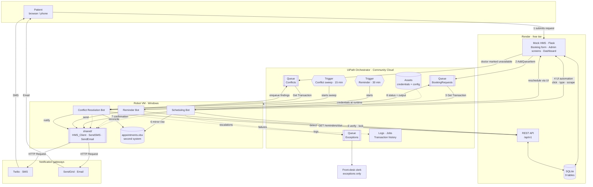
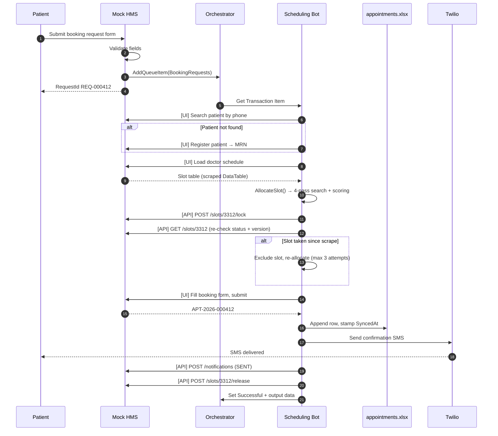
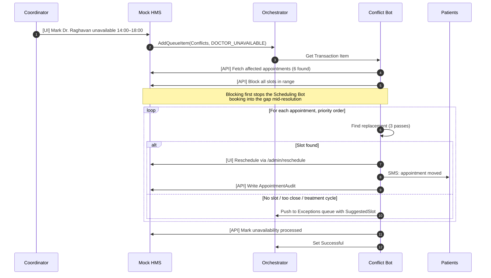

# System Architecture

**Scope:** How the bots, Orchestrator, Mock HMS and notification gateways fit together, and why each boundary is where it is.

---

## 1. Component diagram



---

## 2. The layers, and what each is responsible for

| Layer | Component | Responsibility | Deliberately not responsible for |
|---|---|---|---|
| **Presentation** | Mock HMS UI | Patient-facing form, admin screens, the surfaces bots automate | Business rules, scheduling logic |
| **Data** | SQLite via SQLAlchemy | System of record; enforces the double-booking unique index | Deciding *which* slot to book |
| **Integration** | REST API `/api/v1` | Verification reads, bulk queries, lock/release, queue hand-off | Replacing the UI path for booking |
| **Orchestration** | Orchestrator queues, triggers, assets | Work distribution, scheduling, credentials, audit trail | Any business logic |
| **Automation** | The three bots | All process logic and decisions | Storing state between runs |
| **Shared** | `HMS_Client`, `SendSMS`, `SendEmail` | Reusable interaction primitives | Knowing anything about scheduling |
| **Notification** | Twilio, SendGrid | Message delivery | Deciding who to message or when |
| **Human** | Front-desk clerk | Exception queue, clinical judgement | Routine bookings |

---

## 3. Why the bots use both UI and API

This is the design question most worth being able to answer in an interview, because using the API for everything would be *easier* and would make it a worse project.

| Operation | Surface | Reason |
|---|---|---|
| Book an appointment | **UI** | This is the RPA thesis: the bot does what the clerk does — clicks, types, reads the screen. Real hospital systems rarely expose a booking API |
| Register a patient | **UI** | Same |
| Scrape the doctor schedule | **UI** | Table extraction from a rendered screen is the genuine RPA skill here |
| Reschedule | **UI** | It is the clerk's action, automated |
| Slot lock / version re-check | **API** | A concurrency primitive with no UI equivalent — a clerk cannot "hold" a slot either, which is exactly the flaw being fixed |
| Bulk reminder query | **API** | Paging through 120 appointments in a UI would be automation theatre, not automation |
| Conflict detection | **API** | A set-based query; no screen represents it |
| Queue hand-off | **API** | System-to-system by definition |

> The honest framing: **UI automation for what a human does, API for what a human cannot.** A bot that clicked through 120 screens to build a reminder list would be a worse system pretending to be a better demo.

---

## 4. Booking sequence



---

## 5. Conflict cascade sequence

The scenario that makes the demo worth watching: one doctor marks half a day of leave.



---

## 6. Data flow and system of record

```
Patient request ──► Mock HMS (SQLite)  ◄── SYSTEM OF RECORD
                          │
                          ├──► Orchestrator queue (work item, transient)
                          │
                          └──► appointments.xlsx (mirror, read-mostly)
                                     ▲
                                     └── Conflict Bot reconciles Excel ← HMS
                                         (one direction only, never HMS ← Excel)
```

**One declared direction of truth.** The HMS is authoritative; Excel is a mirror that gets corrected. Bidirectional sync between two systems with no conflict-resolution protocol is how reconciliation bugs become data loss — and a project this size has no business inventing one.

---

## 7. Deployment topology

| Component | Where | Notes |
|---|---|---|
| Mock HMS | Render free tier | Public URL; cold-starts after 15 min idle — warm it before demoing |
| SQLite file | Render ephemeral disk | Resets on redeploy; `POST /admin/reseed` restores demo state |
| Orchestrator | UiPath Automation Cloud | Community tenant, one folder: `RPA-Scheduler` |
| Robot | Windows VM or local Studio | Community allows one unattended robot — the three bots share it, so they run sequentially, not in parallel |
| Twilio / SendGrid | SaaS | Free tiers; trial numbers must be verified |
| Source | GitHub | `.xaml`, Flask app, docs |

> **The one-robot constraint is load-bearing.** Community Edition gives a single unattended robot, so the Reminder trigger and the Conflict sweep cannot overlap. Triggers are staggered — Reminder on `:00/:30`, Conflict sweep on `:07/:22/:37/:52` — and every job has a stop-if-exceeds timeout so a hung job cannot block the next one indefinitely.

---

## 8. Security boundaries

| Secret | Stored in | Never in |
|---|---|---|
| HMS API key | Orchestrator Asset (Credential) | `.xaml`, `Config.xlsx`, GitHub |
| Twilio SID / token | Orchestrator Asset (Credential) | Anywhere in the repo |
| SendGrid API key | Orchestrator Asset (Credential) | Anywhere in the repo |
| Orchestrator client secret | Render environment variable | The Flask source |

**Patient data handling:** `body_preview` on `Notification` is capped at 255 characters and logs are scrubbed of full phone numbers (`+9198****3210`). This is *not* HIPAA compliance — the brief puts that out of scope — but the report should say so explicitly rather than leave a reader assuming it was considered and handled.

---

## 9. Failure modes and how each is contained

| Failure | Contained by | Result |
|---|---|---|
| Render app asleep / down | System exception + Orchestrator retry | Items stay `New`, processed when it wakes |
| Orchestrator unreachable at intake | HMS persists with `queue_status = PENDING_PUSH`, background retry | No booking request is lost |
| Two bots target one slot | Lock → version re-check → DB unique index | Second bot re-allocates; no double-booking |
| Bot crashes mid-transaction | `FINALLY` releases the lock; item returns to the queue | Slot not stranded; work retried |
| Twilio credit exhausted | Non-retryable error → `FAILED` + LOW conflict | Other reminders continue |
| Excel file locked by a human | System exception `EXCEL_FILE_LOCKED`, retry | Mirror catches up on the next sweep |
| Reminder trigger double-fires | Idempotency check + `max_concurrent_jobs = 1` | No duplicate messages |
| Conflict resolution loops | `max_reschedules_per_appointment = 2` | Escalates instead of bouncing a patient |

---

## 10. Technology choices — the short defence

| Choice | Over | Because |
|---|---|---|
| Orchestrator queues | A database table the bots poll | Queues give once-only delivery, retry, status and an audit trail for free — rebuilding that is the actual engineering content |
| Flask + SQLite | A commercial HMS sandbox | Full control over the UI, so selectors are stable and failure modes are plantable on demand |
| Excel as a second system | A second database | Reconciliation against a spreadsheet is what most real automation projects actually face |
| Time trigger for reminders | A queue | Reminders are due because time passed, not because an event happened |
| `rules.yaml` externalised | Rules inside `.xaml` | Policy changes without a redeploy, and the rules are reviewable by the coordinator who owns them |
| REFramework | A plain sequence | Built-in retry, transaction status and business/system exception split are the patterns UiPath roles interview on |

---

## 11. Phase 2 exit check

- [x] Every bot has a flowchart and pseudocode precise enough to build from
- [x] The slot allocation algorithm is fully specified, including tie-breaks
- [x] Reminder scheduling, channel selection and retry are decided
- [x] All four conflict types have a documented resolution strategy and escalation rule
- [x] Every tunable value is in `rules.yaml`, not buried in prose
- [x] Component, sequence and data-flow diagrams are drawn
- [x] Failure modes are enumerated with their containment

> **Phase 3 can begin.** Someone else could build `mock_hms/` from [`../phase1/data_model.md`](../phase1/data_model.md) + [`../phase1/hms_interfaces.md`](../phase1/hms_interfaces.md), and the three bots from the specs in this folder, without making a new design decision.
