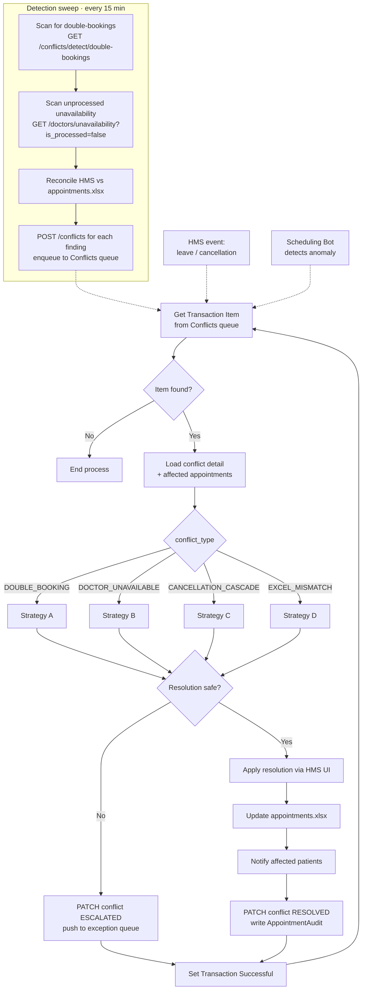

# Conflict Resolution Bot — Design Spec

**Type:** Unattended, hybrid — queue-driven **and** sweep-driven
**Input queue:** `Conflicts`
**Also runs:** A detection sweep on a 15-minute Orchestrator trigger that finds conflicts nobody reported
**Output:** Rescheduled or cancelled appointments, notified patients, resolved `ConflictLog` rows, escalations to the exception queue

---

## 1. Why this bot is both queue- and sweep-driven

Some conflicts announce themselves — a coordinator marks a doctor unavailable, and the HMS enqueues a conflict item. Others are *silent*: a double-booking that slipped past the guards, or a row that exists in the HMS but not in Excel. Nothing raises an event for those; the only way to find them is to go looking.

So the bot has two front doors:

| Path | Trigger | Handles |
|---|---|---|
| **Queue** | Item in `Conflicts` | Reported conflicts — reacted to within seconds |
| **Sweep** | 15-min time trigger | Silent conflicts — found by scanning, then enqueued into the same queue |

The sweep does not resolve anything itself. It **detects and enqueues**, so every conflict flows through one resolution path regardless of how it was found. One code path, one audit trail.

---

## 2. The four conflict types

| Type | Severity | Detected by | Typical volume |
|---|---|---|---|
| `DOUBLE_BOOKING` | HIGH | Sweep + Scheduling Bot | ~10/week today, target 0 undetected |
| `DOCTOR_UNAVAILABLE` | HIGH | HMS event + sweep | ~6/week |
| `CANCELLATION_CASCADE` | MEDIUM | HMS event | ~20/week |
| `EXCEL_MISMATCH` | LOW | Sweep only | 5–10% of rows at month-end today |

---

## 3. Main flowchart



---

## 4. Strategy A — `DOUBLE_BOOKING`

**Definition:** two or more non-cancelled appointments hold the same `slot_id`.

**Detection:**
```sql
SELECT slot_id, COUNT(*) FROM appointment
WHERE status NOT IN ('CANCELLED','NO_SHOW')
GROUP BY slot_id HAVING COUNT(*) > 1
```

**Principle:** one appointment keeps the slot, the rest are rebooked. The question is *who keeps it*, and the answer must be rule-based, never arbitrary.

```
FUNCTION ResolveDoubleBooking(conflict):
    appts = AppointmentsOn(conflict.slot_id) WHERE status NOT IN (CANCELLED, NO_SHOW)

    # Rank by who has the strongest claim
    ranked = appts ORDER BY
        PriorityRank(priority) ASC,      # URGENT=1, HIGH=2, NORMAL=3
        is_follow_up DESC,               # treatment continuity wins
        created_at ASC,                  # first-come tie-break
        appointment_id ASC               # deterministic final tie-break

    keeper = ranked[0]
    losers = ranked[1..]

    FOR EACH loser IN losers:
        IF loser.appointment_datetime < Now + rules.min_reschedule_notice_hours THEN
            ESCALATE(loser, "TOO_CLOSE_TO_RESCHEDULE"); CONTINUE

        IF loser.is_follow_up AND loser.previous_appointment_id IS NOT NULL THEN
            ESCALATE(loser, "TREATMENT_CYCLE_NEEDS_APPROVAL"); CONTINUE

        newSlot = FindReplacementSlot(loser)
        IF newSlot IS NULL THEN
            ESCALATE(loser, "NO_REPLACEMENT_SLOT"); CONTINUE

        Reschedule(loser, newSlot)       # via /admin/reschedule UI
        Notify(loser.patient, TPL_RESCHEDULE_EN)
        Audit(loser, "CONFLICT_RESOLVED", from=oldSlot, to=newSlot)

    RETURN RESOLVED
```

**`FindReplacementSlot`** reuses the Scheduling Bot's `AllocateSlot.xaml` with the original request reconstructed from the appointment — same doctor preferred, a window of `±rules.reschedule_window_days` around the original date. Reusing one allocation implementation means a rescheduled patient is treated by exactly the same fairness rules as a new one.

**Escalation is the right answer, not a failure.** Three cases hand back to a human: a rebook inside the notice period, a treatment-cycle appointment, and no viable replacement slot. Silently moving someone mid-chemotherapy-cycle to another week would be a far worse outcome than a clerk getting a task.

---

## 5. Strategy B — `DOCTOR_UNAVAILABLE`

**Definition:** a `DoctorUnavailability` row overlaps slots that already hold appointments.

**Trigger:** coordinator saves unavailability on `/admin/doctors`, or the sweep finds `is_processed = false`.

```
FUNCTION ResolveDoctorUnavailable(conflict):
    unavail  = GetUnavailability(conflict)
    affected = Appointments WHERE doctor_id = unavail.doctor_id
                 AND appointment_datetime BETWEEN unavail.from AND unavail.to
                 AND status NOT IN (CANCELLED, COMPLETED, NO_SHOW)

    # Block the slots first, so the Scheduling Bot cannot book into the gap
    # while this resolution is still running.
    FOR EACH slot IN SlotsInRange(unavail):
        PATCH slot SET status = 'BLOCKED'

    # Highest-priority patients get first pick of the remaining capacity
    ordered = affected ORDER BY PriorityRank(priority) ASC,
                                appointment_datetime ASC

    FOR EACH appt IN ordered:
        # Pass 1: same department, another doctor, same day, same time band
        newSlot = FindSlot(dept=appt.department, date=appt.date,
                           band=BandOf(appt.time), excludeDoctor=unavail.doctor_id)

        # Pass 2: same doctor, after the unavailability ends
        IF newSlot IS NULL THEN
            newSlot = FindSlot(doctor=unavail.doctor_id,
                               dateFrom=unavail.to, dateTo=unavail.to + reschedule_window_days)

        # Pass 3: any doctor in the department, within the reschedule window
        IF newSlot IS NULL THEN
            newSlot = FindSlot(dept=appt.department,
                               dateFrom=appt.date, dateTo=appt.date + reschedule_window_days)

        IF newSlot IS NULL THEN
            ESCALATE(appt, "NO_REPLACEMENT_SLOT"); CONTINUE

        Reschedule(appt, newSlot)
        Notify(appt.patient, TPL_RESCHEDULE_EN)
        Audit(appt, "CONFLICT_RESOLVED", note="Doctor unavailable: " + unavail.reason)

    PATCH unavail SET is_processed = true
    RETURN RESOLVED
```

> **Block the slots before rescheduling.** A half-day of leave is 12–16 patients and takes minutes to work through. Without blocking first, the Scheduling Bot can book a brand-new patient into a slot for a doctor who is on leave — while this bot is busy moving everyone *out* of that same block.

**Order matters twice over:** priority order means the urgent patient gets the good replacement slot, not whoever happened to be alphabetically first.

---

## 6. Strategy C — `CANCELLATION_CASCADE`

**Definition:** a patient cancels, freeing a slot. Not a conflict in the strict sense — it is an *opportunity* that the manual process wastes entirely.

```
FUNCTION ResolveCancellationCascade(conflict):
    cancelled = GetAppointment(conflict.appointment_id)

    PATCH cancelled SET status = 'CANCELLED'
    PATCH cancelled.slot SET status = 'AVAILABLE', version = version + 1
    UpdateExcel(cancelled.reference_no, status='CANCELLED')
    Notify(cancelled.patient, TPL_CANCELLATION_EN)

    IF NOT rules.enable_waitlist_backfill THEN RETURN RESOLVED

    # Who would be better off in the freed slot?
    candidates = Appointments WHERE department = cancelled.department
        AND status = 'SCHEDULED'
        AND appointment_datetime > cancelled.appointment_datetime   # currently booked later
        AND appointment_datetime <= Now + rules.backfill_horizon_days
        AND priority IN ('URGENT','HIGH')
        AND appointment_datetime > Now + rules.min_reschedule_notice_hours

    IF candidates IS EMPTY THEN RETURN RESOLVED

    best = candidates ORDER BY PriorityRank(priority) ASC,
                               appointment_datetime DESC    # the one waiting longest
                      FIRST

    IF cancelled.slot.start < Now + rules.min_reschedule_notice_hours THEN
        RETURN RESOLVED    # too soon to move anyone into it

    Reschedule(best, cancelled.slot)
    Notify(best.patient, TPL_RESCHEDULE_EN, note="Earlier slot available")
    Audit(best, "CONFLICT_RESOLVED", note="Backfilled from cancellation")
    RETURN RESOLVED
```

> **Backfill moves people earlier, never later.** The guard `appointment_datetime > cancelled.appointment_datetime` is what makes this a favour rather than an imposition — an urgent patient booked for next Thursday gets pulled into tomorrow's freed slot. Moving someone *later* to fill a gap would be optimising the hospital's calendar at the patient's expense, and the rule flag `enable_waitlist_backfill` exists so the behaviour can be switched off entirely if the policy is disputed.

---

## 7. Strategy D — `EXCEL_MISMATCH`

**Definition:** the HMS and `data/appointments.xlsx` disagree. Reconciliation key is `ReferenceNo`.

```
FUNCTION ReconcileExcel():
    hmsRows   = GET /appointments?from=Today&to=Today+30
    excelRows = ReadRange(appointments.xlsx)

    FOR EACH h IN hmsRows:
        e = excelRows WHERE ReferenceNo = h.reference_no
        IF e IS NULL THEN
            Raise(EXCEL_MISMATCH, LOW, "MISSING_IN_EXCEL", h)     # auto-fixable
        ELSE IF e.Status != h.status THEN
            Raise(EXCEL_MISMATCH, LOW, "STATUS_DRIFT", h)         # auto-fixable
        ELSE IF e.AppointmentDate != h.date OR e.AppointmentTime != h.time THEN
            Raise(EXCEL_MISMATCH, MEDIUM, "DATETIME_DRIFT", h)    # auto-fixable

    FOR EACH e IN excelRows:
        h = hmsRows WHERE reference_no = e.ReferenceNo
        IF h IS NULL THEN
            Raise(EXCEL_MISMATCH, MEDIUM, "ORPHAN_IN_EXCEL", e)   # escalate
```

**Resolution — the HMS is the system of record:**

| Finding | Action |
|---|---|
| `MISSING_IN_EXCEL` | Append the row from the HMS; stamp `SyncedAt` |
| `STATUS_DRIFT` | Overwrite Excel with the HMS status |
| `DATETIME_DRIFT` | Overwrite Excel with the HMS datetime |
| `ORPHAN_IN_EXCEL` | **Escalate.** A row in Excel with no HMS appointment means either a manual entry or a lost booking — never auto-delete |

> The bot fixes Excel and never edits the HMS from Excel. A single declared direction of truth is what keeps the reconciliation safe to run unattended; deleting an "orphan" row could destroy the only record of a booking the HMS lost.

---

## 8. Escalation contract

Escalated items go to the `Conflicts_Exceptions` queue with everything a clerk needs to act without investigating:

```json
{ "ConflictId": 88, "ConflictType": "DOUBLE_BOOKING",
  "Reason": "TREATMENT_CYCLE_NEEDS_APPROVAL",
  "AppointmentRef": "APT-2026-000412",
  "PatientName": "R. Krishnan", "PatientPhone": "+919876543210",
  "CurrentSlot": "2026-09-16 10:20 · Dr. Meera Raghavan",
  "SuggestedSlot": "2026-09-18 11:00 · Dr. Meera Raghavan",
  "WhyEscalated": "Follow-up in an active treatment cycle; reschedule needs coordinator approval",
  "DetectedAt": "2026-09-15T09:32:11+05:30" }
```

**Escalation reason codes:** `TOO_CLOSE_TO_RESCHEDULE` · `TREATMENT_CYCLE_NEEDS_APPROVAL` · `NO_REPLACEMENT_SLOT` · `ORPHAN_IN_EXCEL` · `PATIENT_UNREACHABLE` · `AMBIGUOUS_PRIORITY`

`SuggestedSlot` is included even when the bot declined to act. The clerk gets a one-click decision instead of a research task.

---

## 9. Safety rules

Non-negotiable constraints, enforced in code and mirrored in `rules.yaml`:

| # | Rule | Why |
|---|---|---|
| 1 | Never reschedule inside `min_reschedule_notice_hours` (default 4 h) | A patient may already be travelling to the hospital |
| 2 | Never reschedule a `URGENT` appointment automatically — always escalate | Clinical urgency is not something a bot should second-guess |
| 3 | Never move an appointment *later* during backfill | Optimises the calendar at the patient's expense |
| 4 | Never auto-delete data in either system | Deletion is unrecoverable; escalate instead |
| 5 | Every reschedule notifies the patient before the transaction closes | A silent move is worse than no move |
| 6 | Every action writes an `AppointmentAudit` row | The change must be explainable afterwards |
| 7 | Max `rules.max_reschedules_per_appointment` (default 2) automatic moves | Stops a patient being bounced repeatedly by successive conflicts |
| 8 | Block affected slots before starting a cascade | Prevents booking into a gap mid-resolution |

> Rule 7 needs the counter: each reschedule increments `reschedule_count` on the appointment. At the limit the bot escalates instead of moving again. Without it, three unrelated conflicts in a week can move the same patient three times, and that patient stops trusting the hospital's messages entirely.

---

## 10. Workflow file layout

```
ConflictResolutionBot/
├── Main.xaml
├── project.json
├── Data/
│   ├── rules.xlsx
│   └── Config.xlsx
└── Workflows/
    ├── InitAllSettings.xaml
    ├── DetectionSweep.xaml           # Runs on the 15-min trigger
    ├── GetTransactionData.xaml
    ├── Process.xaml                  # Routes by conflict_type
    ├── ResolveDoubleBooking.xaml
    ├── ResolveDoctorUnavailable.xaml
    ├── ResolveCancellation.xaml
    ├── ReconcileExcel.xaml
    ├── FindReplacementSlot.xaml      # Wraps the shared AllocateSlot logic
    ├── RescheduleAppointment.xaml
    ├── EscalateToHuman.xaml
    └── SetTransactionStatus.xaml
```

---

## 11. Test hooks for Phase 4

| Scenario | Setup | Expected |
|---|---|---|
| Double-booking, clear priority | URGENT + NORMAL on one slot | URGENT keeps it, NORMAL rebooked and notified |
| Double-booking, equal priority | Two NORMAL on one slot | Earlier `created_at` keeps it |
| Double-booking, too close | Conflict 2 h before the appointment | Escalated `TOO_CLOSE_TO_RESCHEDULE` |
| Doctor leave, half day | Mark 4 h unavailable, 6 appointments | Slots blocked, all 6 handled, priority order respected |
| Doctor leave, no capacity | Leave on a fully-booked day | Some rebooked, rest escalated `NO_REPLACEMENT_SLOT` |
| Cancellation backfill | Cancel a slot, HIGH patient booked later | HIGH patient pulled earlier and notified |
| Backfill disabled | `enable_waitlist_backfill = false` | Slot freed, nobody moved |
| Excel missing row | Delete a row from the workbook | Row restored from the HMS |
| Excel orphan row | Add a fake row to the workbook | Escalated, **not** deleted |
| Reschedule limit | Appointment already moved twice | Escalated `AMBIGUOUS_PRIORITY`, not moved again |
| Sweep finds silent conflict | Plant a double-booking via the API | Sweep detects within 15 min and enqueues it |

> Next: [`rules.yaml`](rules.yaml)
