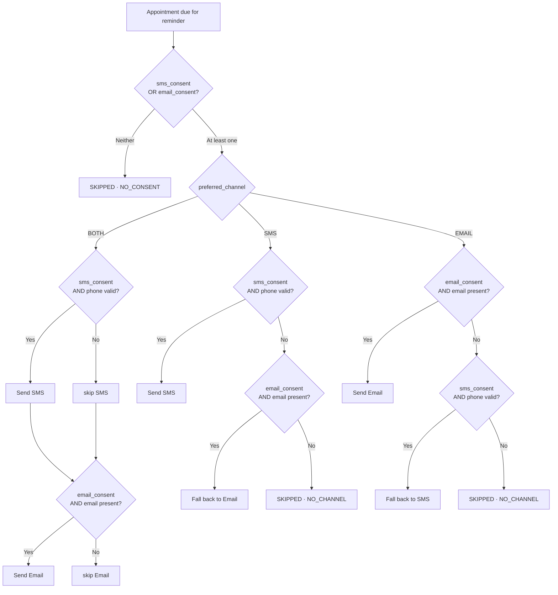
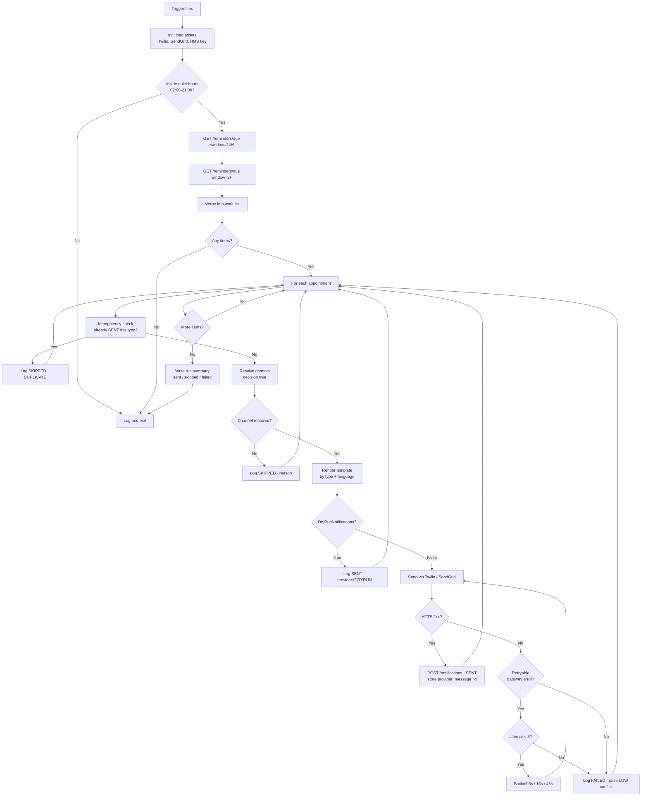

# Reminder Bot — Design Spec

**Type:** Unattended, time-triggered (not queue-driven)
**Trigger:** Orchestrator time trigger, every 30 minutes, 07:00–21:00 local
**Input:** `GET /reminders/due?window=24H|2H`
**Output:** SMS/email sent via Twilio/SendGrid, one `Notification` row per attempt

---

## 1. Why time-triggered and not queue-driven

The Scheduling Bot reacts to an event (a request arrives). The Reminder Bot reacts to *time passing* — an appointment silently becomes due for a reminder with nobody doing anything. A queue would need something to enqueue items on a schedule, which is the trigger, one layer removed. Triggering directly on time is the simpler correct design.

**Consequence:** the bot must be **idempotent**. A trigger can fire twice, a run can crash halfway, and a clock can drift. The bot is therefore built so that running it five times in a row sends exactly the same messages as running it once.

---

## 2. Reminder schedule

| Reminder | Fires when | Window tolerance | Purpose |
|---|---|---|---|
| `REMINDER_24H` | 24 h before `appointment_datetime` | ±30 min | Gives the patient time to cancel or reschedule |
| `REMINDER_2H` | 2 h before `appointment_datetime` | ±30 min | Catches the "forgot it was today" no-show |

**Window tolerance exists because the trigger is discrete.** Running every 30 minutes means the bot never lands exactly on T-24h. It claims every appointment whose target moment falls inside the half-hour it is responsible for:

```
FOR window IN ["24H", "2H"]:
    offsetHours = (window == "24H") ? 24 : 2
    targetFrom  = Now + offsetHours hours - 15 minutes
    targetTo    = Now + offsetHours hours + 15 minutes
    due = GET /reminders/due?window={window}&from={targetFrom}&to={targetTo}
```

**Suppression rules — no reminder is sent when:**

| Condition | Why |
|---|---|
| A `SENT` notification of that type already exists | Idempotency |
| `appointment.status` is `CANCELLED`, `COMPLETED` or `NO_SHOW` | Nothing to remind about |
| Current time is outside the 07:00–21:00 quiet-hours window | Never wake a patient at 03:00 |
| The appointment is less than 2 h away and the window is `24H` | A late booking skips straight to the 2 h reminder |
| Both `sms_consent` and `email_consent` are FALSE | Logged as `SKIPPED`, reason `NO_CONSENT` |

> **Quiet hours interaction:** a 2 h reminder for an 08:00 appointment would fire at 06:00, inside quiet hours. The rule is *defer, do not drop* — it is re-attempted at the 07:00 run and still lands an hour before the appointment. A reminder whose appointment has already started is dropped and logged `SKIPPED / TOO_LATE`.

---

## 3. Channel decision tree — SMS vs email



### Escalation on the 2 h reminder

For `REMINDER_2H` on an appointment marked `URGENT` or `HIGH` priority, the bot sends on **both** available channels regardless of `preferred_channel`. Missing an urgent appointment costs more than a redundant message.

### Channel selection rules in table form

| `preferred_channel` | Both consents | SMS only | Email only | Neither |
|---|---|---|---|---|
| `SMS` | SMS | SMS | Email (fallback) | Skip |
| `EMAIL` | Email | SMS (fallback) | Email | Skip |
| `BOTH` | SMS + Email | SMS | Email | Skip |

> "Phone valid" means it matches E.164 (`^\+[1-9]\d{9,14}$`). "Email present" means non-null and matching a basic RFC-ish pattern. Malformed contact data is a `SKIPPED / INVALID_CONTACT` outcome, and it raises a low-severity conflict so someone eventually fixes the patient record.

---

## 4. Main flowchart



---

## 5. Retry logic

Retries happen **inside one run**, per message. The bot never relies on the next trigger to retry, because the next trigger may be 30 minutes away and a 2 h reminder cannot afford that.

| Attempt | Delay before | Cumulative |
|---|---|---|
| 1 | 0 s | 0 s |
| 2 | 5 s | 5 s |
| 3 | 15 s | 20 s |
| — | give up at 45 s total | |

### Which gateway errors are retryable

| Provider | Code / status | Retryable | Reason |
|---|---|---|---|
| Twilio | `429` | Yes | Rate limited — back off |
| Twilio | `500`, `503` | Yes | Transient gateway fault |
| Twilio | `21211` invalid `To` number | **No** | Bad data — retrying cannot fix it |
| Twilio | `21610` recipient unsubscribed | **No** | Also flips `sms_consent` to FALSE in the HMS |
| Twilio | `21608` unverified number (trial) | **No** | Expected on the free tier; logged clearly |
| SendGrid | `429` | Yes | Rate limited |
| SendGrid | `5xx` | Yes | Transient |
| SendGrid | `400` invalid recipient | **No** | Bad data |
| SendGrid | `401` | **No** | System exception — API key asset is wrong |
| Any | Network timeout | Yes | Transient |

> **Consent write-back.** A `21610` unsubscribe is the one case where the bot writes patient data: it `PATCH`es `sms_consent = false`. Continuing to message someone who opted out is the kind of thing that turns a demo into a compliance story, and handling it is a good interview answer.

### Failure is never silent

Three exhausted attempts produce: a `Notification` row with `status = FAILED` and the `error_code`, a `LOW` severity `ConflictLog` entry, and a line in the run summary. The run continues to the next appointment — one patient's bad phone number must not stop 119 other reminders.

---

## 6. Message templates

Stored in `Data/templates.xlsx`, keyed by `template_id`. Selected by `type` + `patient.preferred_language`.

| `template_id` | Channel | Used for |
|---|---|---|
| `TPL_CONFIRMATION_EN` | SMS | Booking confirmation (sent by Scheduling Bot) |
| `TPL_CONFIRMATION_EMAIL_EN` | Email | Booking confirmation |
| `TPL_REMINDER_24H_EN` | SMS | T-24h |
| `TPL_REMINDER_24H_EMAIL_EN` | Email | T-24h |
| `TPL_REMINDER_2H_EN` | SMS | T-2h |
| `TPL_REMINDER_2H_EMAIL_EN` | Email | T-2h |
| `TPL_RESCHEDULE_EN` | SMS | Slot changed (Conflict Bot) |
| `TPL_CANCELLATION_EN` | SMS | Appointment cancelled (Conflict Bot) |

**Placeholders:** `{PatientName}` `{DoctorName}` `{Department}` `{Date}` `{Time}` `{ReferenceNo}` `{HospitalName}` `{CancelUrl}`

**SMS, T-24h:**
```
Hi {PatientName}, reminder: your appointment with {DoctorName}
({Department}) is tomorrow {Date} at {Time}.
Ref {ReferenceNo}. To cancel, call 080-XXXXXXX. - {HospitalName}
```

**SMS, T-2h:**
```
Hi {PatientName}, your appointment with {DoctorName} is today at
{Time}. Please arrive 15 min early. Ref {ReferenceNo}. - {HospitalName}
```

> SMS templates are kept under 160 characters after substitution. A 161-character message silently becomes two billed segments on Twilio's trial credit, and the trial does not stretch far.

---

## 7. Trigger configuration

| Setting | Value |
|---|---|
| Type | Time trigger (cron) |
| Expression | `0 0,30 7-21 * * ?` — every 30 min, 07:00–21:00 |
| Time zone | `Asia/Kolkata` |
| Max concurrent jobs | **1** — a second concurrent run would double-send |
| Stop job if it exceeds | 20 minutes |

> `Max concurrent = 1` is the single most important setting here. The idempotency check protects against it, but two runs racing on the same appointment can both pass the check before either writes its `Notification` row.

---

## 8. Run summary output

Every run writes one summary line to Orchestrator logs, giving the Phase 4 report its reminder-coverage metric directly:

```json
{ "run_at": "2026-09-15T09:30:00+05:30",
  "window_24h_found": 14, "window_2h_found": 6,
  "sent_sms": 15, "sent_email": 9,
  "skipped": {"DUPLICATE": 2, "NO_CONSENT": 1, "NO_CHANNEL": 1, "TOO_LATE": 0},
  "failed": 1, "duration_seconds": 42 }
```

---

## 9. Workflow file layout

```
ReminderBot/
├── Main.xaml
├── project.json
├── Data/
│   ├── templates.xlsx
│   └── Config.xlsx
└── Workflows/
    ├── InitAllSettings.xaml
    ├── GetDueReminders.xaml
    ├── ResolveChannel.xaml       # Pure logic — unit testable
    ├── RenderTemplate.xaml
    ├── SendWithRetry.xaml        # Wraps shared SendSMS / SendEmail
    ├── LogNotification.xaml
    └── WriteRunSummary.xaml
```

---

## 10. Test hooks for Phase 4

| Scenario | Setup | Expected |
|---|---|---|
| Happy path 24 h | Appointment 24 h out, SMS consent | One SMS, `Notification` = `SENT` |
| Idempotency | Run the bot twice back to back | Second run: all `SKIPPED / DUPLICATE` |
| Channel fallback | `preferred_channel = SMS`, `sms_consent = false`, email present | Email sent |
| No channel | Both consents false | `SKIPPED / NO_CONSENT`, no send |
| Invalid phone | Malformed phone, no email | `SKIPPED / INVALID_CONTACT` + LOW conflict |
| Cancelled appointment | Cancel, then run | No reminder sent |
| Quiet hours | 2 h reminder due at 06:00 | Deferred to the 07:00 run |
| Urgent escalation | `URGENT` appointment, 2 h window | Both SMS and email sent |
| Gateway failure | Invalid Twilio key | 3 attempts, `FAILED`, run continues |
| Dry run | `DryRunNotifications = True` | `SENT / provider=DRYRUN`, no real send |

> Next: [`bot_conflict.md`](bot_conflict.md)
