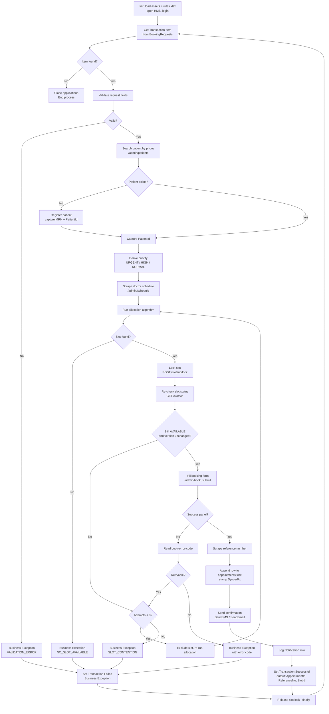

# Scheduling Bot — Design Spec

**Type:** Unattended, queue-driven (REFramework dispatcher/performer pattern)
**Input queue:** `BookingRequests`
**Output:** A booked appointment in the HMS, a mirrored row in `appointments.xlsx`, a confirmation notification, and queue output data
**Runs:** Continuously, or on a 5-minute Orchestrator trigger that processes the queue until empty

---

## 1. Responsibilities

| # | Does | Does not |
|---|---|---|
| 1 | Look up or register the patient by phone | Merge near-duplicate patient records |
| 2 | Allocate the best available slot by documented rules | Override a department's daily cap |
| 3 | Book through the HMS UI with an optimistic lock | Book into an emergency-reserve slot for a non-urgent case |
| 4 | Mirror the appointment into Excel | Resolve Excel drift (that's the Conflict Bot) |
| 5 | Send the confirmation notification | Send reminders |
| 6 | Close the transaction with output data, or fail it with a reason code | Silently swallow an exception |

---

## 2. Main flowchart



---

## 3. Slot allocation algorithm

The core of the bot. Runs entirely on the DataTable scraped from `/admin/schedule`, so it is testable in isolation.

### 3.1 Inputs

| Input | Source |
|---|---|
| `Request` | Queue item — department, preferred doctor, date window, time band, urgency |
| `Patient` | HMS — `is_senior`, history |
| `SlotTable` | Scraped DataTable from `/admin/schedule` |
| `Rules` | `Data/rules.xlsx`, generated from `rules.yaml` |
| `ExcludedSlotIds` | Slots already tried and lost this transaction |

### 3.2 Priority derivation

Run **before** allocation, because priority changes which slots are eligible.

```
FUNCTION DerivePriority(request, patient):
    IF request.Urgency == "URGENT"        THEN RETURN "URGENT"
    IF request.Urgency == "HIGH"          THEN RETURN "HIGH"
    IF patient.is_senior == TRUE          THEN RETURN "HIGH"
    IF request.IsFollowUp == TRUE         THEN RETURN "HIGH"
    RETURN "NORMAL"
```

### 3.3 Four-pass search

Passes run in order. The first pass that yields a candidate wins — no pass is skipped ahead of an earlier one, because that ordering *is* the business policy.

```
FUNCTION AllocateSlot(request, patient, slotTable, rules, excludedSlotIds):

    priority = DerivePriority(request, patient)

    # Eligibility filter, applied to every pass
    candidates = slotTable WHERE
        Status == "AVAILABLE"
        AND SlotId NOT IN excludedSlotIds
        AND Date BETWEEN request.DateFrom AND request.DateTo
        AND Doctor.is_active == TRUE
        AND (IsEmergencyReserve == FALSE OR priority == "URGENT")
        AND DoctorDailyCount(DoctorId, Date) < Doctor.daily_slot_cap
        AND DepartmentDailyCount(Date) < Department.max_daily_appointments
        AND SlotStart >= Now + rules.min_booking_lead_hours
        AND SlotStart <= Now + rules.max_booking_horizon_days

    IF candidates IS EMPTY THEN RETURN NULL

    # ---- PASS 1: preferred doctor, preferred time band ----
    IF request.PreferredDoctor != "Any" THEN
        p1 = candidates WHERE DoctorId == request.PreferredDoctor
                          AND InTimeBand(StartTime, request.TimeBand)
        IF p1 NOT EMPTY THEN RETURN BestOf(p1, priority, rules)

    # ---- PASS 2: preferred doctor, any time ----
    IF request.PreferredDoctor != "Any" THEN
        p2 = candidates WHERE DoctorId == request.PreferredDoctor
        IF p2 NOT EMPTY THEN RETURN BestOf(p2, priority, rules)

    # ---- PASS 3: any doctor in department, preferred time band ----
    p3 = candidates WHERE InTimeBand(StartTime, request.TimeBand)
    IF p3 NOT EMPTY THEN RETURN BestOf(p3, priority, rules)

    # ---- PASS 4: any doctor, any time (first-fit fallback) ----
    IF candidates NOT EMPTY THEN RETURN BestOf(candidates, priority, rules)

    RETURN NULL
```

### 3.4 Choosing within a pass — `BestOf`

Inside a pass the candidates are scored, not just taken first-fit. Scoring is what makes the allocation defensible in an interview.

```
FUNCTION BestOf(candidates, priority, rules):

    FOR EACH slot IN candidates:
        score = 0

        # Earliest-first is the dominant term
        daysOut = DaysBetween(Today, slot.Date)
        score += (rules.weight_earliest * (rules.max_booking_horizon_days - daysOut))

        # Urgent cases get a hard pull toward the soonest slot
        IF priority == "URGENT" THEN
            score += (rules.weight_urgency_boost * (rules.max_booking_horizon_days - daysOut))

        # Prefer the exact requested time band
        IF InTimeBand(slot.StartTime, request.TimeBand) THEN
            score += rules.weight_time_band_match

        # Prefer the patient's preferred doctor
        IF slot.DoctorId == request.PreferredDoctor THEN
            score += rules.weight_preferred_doctor

        # Load balancing: prefer the less-loaded doctor that day
        load = DoctorDailyCount(slot.DoctorId, slot.Date) / Doctor.daily_slot_cap
        score += (rules.weight_load_balance * (1 - load))

        # Avoid fragmenting the day: prefer a slot adjacent to an existing booking
        IF HasAdjacentBooking(slot) THEN
            score += rules.weight_contiguity

        slot.Score = score

    RETURN candidates ORDER BY Score DESC,
                              Date ASC,
                              StartTime ASC,
                              SlotId ASC
                     FIRST
```

> **Deterministic tie-break.** The final `SlotId ASC` matters: two runs over the same data must pick the same slot, or the Phase 4 tests are not reproducible.

### 3.5 Time bands

| Band | Window |
|---|---|
| `MORNING` | `opens_at` → 12:59 |
| `AFTERNOON` | 13:00 → `closes_at` |
| `ANY` | Whole clinic day — `InTimeBand` returns TRUE for every slot |

---

## 4. Optimistic locking — the double-booking guard

Three layers, deliberately overlapping:

| Layer | Mechanism | Catches |
|---|---|---|
| 1 | `POST /slots/{id}/lock` with 120 s TTL | Another bot working the same slot concurrently |
| 2 | `GET /slots/{id}` re-check of `status` **and** `version` before submit | A change between scrape and submit |
| 3 | Partial unique index on `slot_id` in the database | Everything else — the last line of defence |

```
FUNCTION BookWithLock(slot, patientId, request):
    TRY
        lockResult = POST /slots/{slot.SlotId}/lock
        IF lockResult.error_code == "SLOT_LOCKED" THEN
            RETURN Retry(reason = "SLOT_LOCKED")

        fresh = GET /slots/{slot.SlotId}
        IF fresh.status != "AVAILABLE" OR fresh.version != slot.version THEN
            RETURN Retry(reason = "SLOT_TAKEN")

        FillBookingForm(patientId, slot.SlotId, priority, reason, queueItemRef)
        Click(book-submit)

        IF Exists(book-success) THEN
            RETURN Scrape(book-reference-no)
        ELSE
            RETURN HandleError(Scrape(book-error-code))
    FINALLY
        POST /slots/{slot.SlotId}/release
    END TRY
```

**The `FINALLY` release is mandatory.** Without it a crashed transaction leaves slots locked for their TTL, and the next 120 seconds of bookings silently degrade.

---

## 5. Retry policy

| Situation | Retryable | Max attempts | Backoff | Then |
|---|---|---|---|---|
| `SLOT_TAKEN` / `SLOT_LOCKED` | Yes | 3 | Immediate, next-best slot | Business exception `SLOT_CONTENTION` |
| `INTERNAL_ERROR` (500) | Yes | 3 | 2 s, 4 s, 8 s | System exception → Orchestrator retries the item |
| HMS UI element not found | Yes | 2 | Refresh page, retry | System exception |
| `VALIDATION_ERROR` | No | — | — | Business exception, straight to exception queue |
| `NO_SLOT_AVAILABLE` | No | — | — | Business exception; clerk widens the date window |
| `UNAUTHORIZED` | No | — | — | System exception — stop the job, an asset is misconfigured |

> **The distinction that matters:** *business* exceptions are the process saying no and must never be retried by Orchestrator. *System* exceptions are the environment failing and should be. Getting this backwards means a bot retries an invalid phone number 3 times and still fails — burning capacity for nothing.

---

## 6. Queue item contract

**In** — `SpecificContent`:
```json
{ "RequestId": "REQ-000412", "PatientName": "R. Krishnan",
  "Phone": "+919876543210", "Email": null,
  "Department": "CARD", "PreferredDoctor": "Any",
  "PreferredDateFrom": "2026-09-16", "PreferredDateTo": "2026-09-20",
  "TimeBand": "MORNING", "Urgency": "NORMAL",
  "IsFollowUp": false, "Reason": "Chest pain follow-up" }
```

**Out** — `Output` on success:
```json
{ "AppointmentId": 412, "ReferenceNo": "APT-2026-000412",
  "SlotId": 3312, "DoctorId": 4, "DoctorName": "Dr. Meera Raghavan",
  "AppointmentDateTime": "2026-09-16T10:20:00",
  "AllocationPass": 3, "AttemptsUsed": 1,
  "NotificationChannel": "SMS", "ExcelSynced": true }
```

`AllocationPass` and `AttemptsUsed` are logged deliberately — they are the metrics that show, in the Phase 4 report, how often patients got their preferred doctor versus a fallback.

---

## 7. Workflow file layout

```
SchedulingBot/
├── Main.xaml                       # REFramework state machine
├── project.json
├── Data/
│   ├── rules.xlsx                  # Generated from rules.yaml
│   └── Config.xlsx                 # Asset names, selectors, URLs
└── Workflows/
    ├── InitAllSettings.xaml
    ├── InitAllApplications.xaml    # Open browser, login to HMS
    ├── GetTransactionData.xaml
    ├── Process.xaml                # Orchestrates the steps below
    ├── LookupOrRegisterPatient.xaml
    ├── ScrapeDoctorSchedule.xaml
    ├── AllocateSlot.xaml           # Pure logic, no UI — unit testable
    ├── BookAppointment.xaml
    ├── MirrorToExcel.xaml
    ├── SendConfirmation.xaml
    ├── SetTransactionStatus.xaml
    └── CloseAllApplications.xaml
```

> `AllocateSlot.xaml` takes a DataTable in and a slot out, touching no UI. That is what makes the Phase 4 edge-case tests possible without a running browser.

---

## 8. Test hooks for Phase 4

| Scenario | Setup | Expected |
|---|---|---|
| Happy path | Valid request, slots free | Booked, Excel row written, SMS sent, `Successful` |
| New patient | Phone not in HMS | Patient registered, then booked |
| Preferred doctor full | Doctor fully booked in window | Pass 3 or 4 used; `AllocationPass > 2` |
| No slot in window | Narrow 1-day window, all booked | `NO_SLOT_AVAILABLE`, exception queue |
| Slot stolen mid-transaction | Book the slot via API between scrape and submit | Retry, books next-best, `AttemptsUsed = 2` |
| Urgent case | `Urgency = URGENT` | Emergency-reserve slot eligible; earliest slot chosen |
| Invalid phone | Malformed phone | `VALIDATION_ERROR`, no retry |
| HMS down | Stop the Render app | System exception, Orchestrator retries |

> Next: [`bot_reminder.md`](bot_reminder.md)
